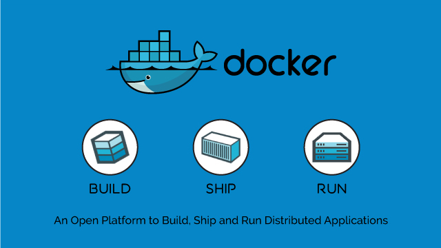

# **1ER DAM. Desarrotllament D'Aplicacions Multiplataforma. EDD. Entorns de Desenvolupament.**
# **Docker, Contenidors, Servidor CollabNet Subversion Edge i Git**

 ***2019-Editat amb [VisualStudioCode](https://code.visualstudio.com/) per a Windows, Linux i Mac.***

 
##### DOCKER. Una plataforma oberta per a construir, envíar i executar aplicacions distribuïdes. 

# INDEX:

>### UNITAT 1. Activitat pràctica d'avaluació continuada 1(APAC).
>***[1.>>Redirigir a treball alojat en Github.](https://github.com/Maxim1erDAM/EDD/blob/master/treballAPACunitat1.md)***

>### UNITAT 2. Eines per al desenvolupament de programari.
>
>***[1.-Com instalar VSCODE en Ubuntu 18.](https://github.com/Maxim1erDAM/EDD/blob/master/treballdocker_maximsanchezporta.md#unitat-2-pr%C3%A1ctica-de-visual-studio-code)***
>
>***[2.-Com instalar extensions en VSCODE en Ubuntu 18.](https://github.com/Maxim1erDAM/EDD/blob/master/treballdocker_maximsanchezporta.md#2-com-instalar-extensions-en-vscode-en-ubuntu-18)***

>### UNITAT 3. Sistemes de control de versions.
>***[1.-Configurar VirtualBox.](https://github.com/Maxim1erDAM/EDD/blob/master/treballdocker_maximsanchezporta.md#1-configurar-virtualbox)***
>
>***[2.-Com instalar docker en Ubuntu 18 o altres distribucions de Ubuntu.](https://github.com/Maxim1erDAM/EDD/blob/master/treballdocker_maximsanchezporta.md#2-com-instalar-docker-en-ubuntu-18-o-altres-distribucions-de-ubuntu)***
>
>***[3.-Assignar contrasenya a root.](https://github.com/Maxim1erDAM/EDD/blob/master/treballdocker_maximsanchezporta.md#3assignar-contrase%C3%B1a-a-root)***
>
>***[4.-Configurar docker.](https://github.com/Maxim1erDAM/EDD/blob/master/treballdocker_maximsanchezporta.md#4configurar-docker)***
>
>***[5.-Com treballar amb GIT de Ubuntu de manera local.](https://github.com/Maxim1erDAM/EDD/blob/master/treballdocker_maximsanchezporta.md#4configurar-docker)***

#    **-Activitat pràctica-**
# UNITAT 1. Activitat pràctica d'avaluació continuada 1(APAC).

>***[1.>>Redirigir a treball alojat en Github.](https://github.com/Maxim1erDAM/EDD/blob/master/treballAPACunitat1.md)***

# UNITAT 2. Práctica de Visual Studio Code.

## 1.-Com instalar VSCODE en Ubuntu 18.

>***`Actualizar llistat de repositoris de Ubuntu:`***  

sudo apt update

>***`Instalar dependencias:`***  

sudo apt install software-properties-common apt-transport-https wget

>***`Importar la clave GPG a Ubuntu:`***  

wget -q https://packages.microsoft.com/keys/microsoft.asc -O- | sudo apt-key add -

>***`Añadir el repositorio:`***  

sudo add-apt-repository "deb [arch=amd64] https://packages.microsoft.com/repos/vscode stable main"

>***`Actualizar listado repositorios de Ubuntu:`***  

sudo apt update

>***`Instalar Visual Studio Code:`***  

sudo apt install code

## 2.-Com instalar extensions en VSCODE.

Podem buscar e instalar extensions desde aquest apartat de VSCODE, podem instalar, desinstalar, activar i desactivar extensions automáticament. Depenent del codi que vullgam activar funcionalitats especials, com etiquetes, o vulgam fer una previsualizació del codi, tindrem que instalar diferents extensions. Solen tardar a instalarse i funcionar per el seu pes, perque contenen les ferramentes i depèndencies per a que funcionen les extensions.

## 3.-Programar en JAVA.
    ¿Quina es la diferència entre JDK y JRE?

JDK es el Java Development Kit o, en español, Herramientas de Desarrollo de Java. Servix per a construir programes utilitzant el llenguatje de programació Java. Incorpora ferramentes útils como el compilador (javac), el desensamblador de binaris (javap), debugger, entre altres ferramentes. El JDK proveu ferramentes d'evaluació de rendiment d'aplicacions, como son VisualVM y Mission Control. Una instalació de JDK ya conté un JRE dins del seus directoris.

JRE es el Java Runtime Environment o, en español, el Entorno de Ejecución de Java. Conté a la Maquina Virtual de Java i altres ferramentes que permiteixen l'execució de les aplicacions Java. JRE no incorpora compiladors ni ferramentes per a desarrotllar les aplicacions Java, nomes incorpora les ferramentes per a executarles.

    ¿Quan deuria utilitzar-los?
Instales el JDK quan vols desenvolupar. Instalat nomes el JRE en els equips on nomes vas a executar aplicacions Java. Per eixemple, si vas a desarrotllar una aplicació GUI en Java, instala el JDK. Si vols que algún amic puga vore eixa aplicació en el seu equip, ell tindrá que instalarse el JRE per a poder executar l'aplicació Java.

*Normalment en un entorn productiu, depen, a mode de evitarte problemes, instalar el JDK.

*Si consideres que el teu entorn productiu será només per a execució de les teues aplicacions Java, entonces convé instalar nomes JRE. 

*Si creus que necesites alguna de las ferramentes de desarrotllament en el teu servidor per a fer probes molt básiques desde eixos equips, per eixemple construir una aplicació xicoteta per a probar la conectivitat a una base de dades, entonces instala el JDK.

## 4.-JAVA JRE O JDK
Instalem desde la font oficial d'Oracle el JRE o el JDK de Java:

https://www.oracle.com/technetwork/java/javase/downloads/ **Fa falta crear un usuari pero podem trobarlo d'altres fonts

Nosaltres descarregarem el JRE. Pero podem gastar un dels dos.
Elegim el paquet JRE o el JDK.

Descarreguem la versió del nostre sistema operatiu. (.exe per a Windows, .rpm per a Linux, tinguent en compte si l'equip es i586-x86 o bé x64)

En Ubuntu per comandes podriem instalar el JRE  o JDK amb la versió per defecte als repositoris d'Ubuntu, directament amb :

sudo apt install default-jre

sudo apt install default-jdk

Per a descomprimir el .tar.gz  del paquet de Java:

sudo tar xzvf fichero.tar.gz

## 5.-INSTALAR EXTENSIONS DE JAVA EN VSCODE Y UTILITZAR FERRAMENTES DE JRE O JDK

Anem a l'apartat d'extensions de Visual Studio Code i instalem "@id:vscjava.vscode-java-pack":

Hem instalat la versió jre-8u231-windows-x64.exe del JRE en Windows 10.

El directori de Windows al instalar JRE 8 es: C:\Program Files\java\jre1.8.0_231\bin

# UNITAT 3. SISTEMES DE CONTROL DE VERSIONS

#### ***`1.¿Que és Docker? Docker es una aplicació de codi obert que permiteix que un servei de Linux i les seues dependencies s'empaqueten como un contenidor. La virtualització basada en contenidors aïlla els serveis y aplicacions entre sí amb un sistema operatiu (OS) compartit. Actualment és compatible amb Windows, Linux i Mac, per tant es multiplataforma.`***

#### ***`2.¿Que és Subversion Edge? CollabNet Subversion Edge es la distribució principal del servidor de Apache Subversion. Subversion Edge inclou una pila completa de software Apache HTTP Server, Subversion i ViewVC, així como una potent interfície d'usuari basada en la web per administrar el servidor. Subversion Edge implementa i administra servidors Apache Subversion de manera eficient amb un entorn d'usuari centralitzat e intuitiu.`***

## 1.-Configurar VirtualBox.

>***`*En VirtualBox, ((ctrl+alt DRET)+c) configura la finestra o maquina virtual.  `***  
### `-En configuració podem configurar el portafolis bidireccional. Per a activarlo`:
> ***`((ctrl+alt DRET)+c)`+`Dispositivos>Portapapeles Compartido> Bidireccional`+` Dispositivos>Arrastrar y Soltar> Bidireccional`***

## -Com activar el portafolis i "Arrastrar i soltar".

`Asignem "Bidireccional" en els dos casos.`

## -Instalar "Guest Additions".

``Fem clic en "Insertar imagen de CD de las <<Guest Additions>>". Es montará la unitat de CDROM amb la ISO corresponent.``

>***`alumne@alumne-VirtualBox:/media/alumne$ `*** 

cd /

>***`alumne@alumne-VirtualBox:/media/alumne$ `***  

cd /media/alumne/VBox_GAs_6.0.12/

>***`Instalar guest additions en una maquina virtual basada en Ubuntu `***    

>***`alumne@alumne-VirtualBox:/media/alumne$ `***

sudo sh VBoxGuestAdditions.run 

##  -Ferramentes per a la máquina virtual.

>***`*Opcional. Instalar editor de text Vim`***

sudo apt install vim

>***`*Opcional. Instalar terminal Tilix`***

sudo apt install tilix

## 2.-Com instalar docker en Ubuntu 18 o altres distribucions de Ubuntu.

   
      
## Instalar docker:
>***`Instalar dependencies dels paquets de docker`***

sudo apt install apt-transport-https ca-certificates curl software-properties-common

>***`Instalar docker des dels repositoris de docker, en Ubuntu 18`*** 

sudo apt install docker-ce

## 3.-Assignar contrasenya a root:

>***`Asignar contrasenya a root e iniciar contrasenya, en el meu cas "alumne" es el usuari de la maquina virtual`***

`USUARIO@USUARIO-VirtualBox:
sudo passwd root`

`>root >root` ***`<Açí afegim la contrasenya de root i la confirmem`***

>***`En el meu cas`***

alumne@alumne-VirtualBox:
sudo passwd root

`>root >root` ***`<Açí afegim la contrasenya de root i la confirmem`***

>***`Iniciar sessió amb root`***

alumne@alumne-VirtualBox:$
 
su root

Contrasenya: ***`<Açí afegim la contrasenya de root`***

>root@alumne-VirtualBox:/home/alumne# ***`<Así ja hem iniciat sesió amb root`***

## 4.-Configurar docker:

>***`Asignem contrasenya a root`*** 

sudo passwd root

>***`Ara inicia sessió en root per a no tindre problemes en docker, pero podriem utilitzar altre usuari amb privilegis com a root`***  

su root

>***`Descarrega la imatge busybox (mini imatge de system o de root, amb el contingut de "system" per a l'arrel, per a poder executar aplicacions independentment de root i el directoris del sistema de l'arrel d'Ubuntu "/" de ubuntu)`***  

docker pull busybox

>***`Descarrega la imatge subversion edge`***  

$apt install subversion

>***`Afegir clau gpg de docker per a afegirla en ubuntu`***

$curl -fsSL https://download.docker.com/linux/ubuntu/gpg | sudo apt-key add -

>***`Comprobar si s'ha descarregat la firma o empremta digital`***

$sudo apt-key fingerprint 0EBFCD88

>***`Tornar a actualizar paquets`***

$sudo apt update

>***`Instalar paquets del repositori de docker`***

$sudo apt install docker-ce

>***`Actualitzar cache de la politica o privacitat de docker`***

$sudo apt-cache policy docker-ce

## `Comandes i configuració de docker`
 
>***`>Iniciem sessió amb usuari root`***
 >alumne@alumne-VirtualBox:~$ 
 su root
Contraseña: ***`<Así afegim la contraseña de root`***
root@alumne-VirtualBox:/home/alumne# 

>***`Mostrar hello world de docker `***

 $docker run hello-world

>***`Activar el servei de docker`***

 $systemctl enable docker

>***`Desactivar el servei de docker`***

 $systemctl disable docker

>***`Descarregar el busybox per a Docker (estructura de system o root per a contenidors o imatges de docker)`***

 $docker pull busybox

>***`Vore imatges que estan instalades en docker`***

 $docker images

>***`Mostra hola per pantalla amb la imatge de busybox per a docker`***

 $docker run busybox echo "hola"

>***`Mostra el ls per pantalla amb la imatge de busybox per a docker`***

$docker run busybox ls

>***`Mostra el fitxer de text del usuari /etc/passwd de la imatge busybox`***

$docker run busybox cat /etc/passwd

>***`Mostra els contenidors de la imatge`***

$docker run busybox ps aux

>***`Activar mode shell dins de la imatge de docker busybox (utilitzar comandes dins de la imatge busybox)`***

$docker run -it busybox sh

>***`Vore els procesos que s'han creat en la sessió actual del usuari i docker*`***

$docker ps -a

>***`Per a eliminar un contenidor, afegir el codi del contenidor eixemple:5dde99182cec`***

$docker rm 5dde99182cec

>***`Ids dels contenidors que ja han acabat la tasca perque tenen status com a exited`***

$docker ps -a -q -f status=exited

>***`Combinar comanda de contenidors que han acabat la tasca amb "comanda de matar els procesos amb status exited".`***

$docker rm$(docker ps -a -q -fstatus=exited)

>***`Executar imatge o contenidor de subversion-edge amb docker .`***

$docker run -d mamohr/subversion-edge

>***`Veiem si el contenidor de subversion-edge es troba en execució`.***

$docker ps

>***`Per a eliminar el contingut de subversion-edge.`***

$docker rm "codi del contenidor"

>***`Tornar a executar subversion-edge correctament (si no te les images les descarrega).`***

$docker run -d -p 3343:3343 -p 4434:4434 -p 18080:18080  --name svn-server mamohr/subversion-edge

>***`Tinguent en compte que la carpeta "/opt/csvn/data" del contenidor, és on el Servidor Subversion guarda tota la informació que genera, la sincronitzarem amb el volum(directori) "/srv/svn-data" . Amb açò ja podem accedir al servidor via web, generar usuaris, i generar repositoris guardant els canvis. Per tant , executarem el contenidor indicant els ports que es redirigirán del contenidor a la maquina local.`***

$docker run -d -p 3343:3343 -p 4434:4434 -p 18080:18080 -v /srv/svn-data:/opt/csvn/data --name svn-server mamohr/subversion-edge

>>>$ 
Unable to find image 'mamohr/subversion-edge:latest' locally
latest: Pulling from mamohr/subversion-edge
469cfcc7a4b3: Pull complete 
7e814dc876c6: Pull complete 
144c1c97a750: Pull complete 
17eb6ecf9d0a: Pull complete 
12492ca50197: Pull complete 
32dc87336990: Pull complete 
Digest: sha256:547356c2d4c2b2a7eb6e8f7b84de52118ca7089b98d2400f7c723e2280022ab6
Status: Downloaded newer image for mamohr/subversion-edge:latest
77c16450dbb29a614a205e95f9c3ca2072f156dc46a67e5a6b2e1b296e660d03

>***`**Instalar el contenidor i les dependencies  del servidor de Subversion Edge de manera manual, si la comanda anterior no el descarrega`***

$apt install subversion

>***`*Accedir a la pagina http de subversion edge amb usuari:admin contraseña:admin , crear un usuari en el meu cas "alumne123." i el repositori "Projecte1"`***

>http://127.0.0.1:3343/csvn/

>***`Pulsar start per a engegar el servidor subversion desde el navegador.`***

>***`Crear usuari "alumne123." i el repositori "Projecte1" desde el servidor subversionedge`***

>***`Detindre el servei de subversion (es troba renombrat així en la ordre de ejecució del contenidor)`***

$docker stop svn-server

>***`Activar el servei de subversion (es troba renombrat així en la ordre de ejecució del contenidor) `***

$docker start svn-server

## `Accedim al servidor amb el usuari administrador "admin" i contraseña 'admin' per defecte per a subversion.`

## `Accedim a la pantalla de creació de usuaris.`

## `Crearem un usuari , hem creat "alumne123." i afegim tots els permisos en el cas de que siga administrador.`

>***`Donar permisos i accesibilitat al usuari, a este enllaç de host en la red local i crear els seus directoris de tags,trunk i branches.*Desde usuari root amb password asignada amb passwd.   `***

## Donem permisos i es crearan els directoris 

>***`svn co http://127.0.0.1:18080/svn/Projecte1 alumne123.`***

`A    alumne123./tags`

`A    alumne123./trunk`

`A    alumne123./branches`

`Revisión obtenida: 1`

>***`Donar permisos i accesibilitat al usuari, a l'enllaç de host de la red local i crear els seus directoris de tags,trunk i branches.* Desde usuari administrador de Ubuntu amb un altre nom com a usuari "alumne". `***

>***`alumne@alumne-VirtualBox:~$ sudo svn co http://127.0.0.1:18080/svn/Projecte1 alumne123.`***
>Reino de autentificación: <http://127.0.0.1:18080> CollabNet Subversion Repository
>Clave de 'alumne123.': **********
>`-----------------------------------------------------------------------`
>ATENCIÓN!  Su contraseña para el reino de autenticación:
>   <http://127.0.0.1:18080> CollabNet Subversion Repository
>solo se puede almacenar en discos sin cifrar.  Está avisado de configurar
>su sistema de manera que Subversion pueda almacenar contraseñas cifradas, si
>es posible.  Vea la documentación para tener más detalles.
>Puede evitar futuras apariciones de este aviso configurando el valor
>de la opción «store-plaintext-passwords» a «yes» o «no» en
>«/home/alumne/.subversion/servers».
>`-----------------------------------------------------------------------`
>Almacenar la clave sin cifrar (sí/no)? S
>Por favor ingrese 'sí' o 'no': Si
>Por favor ingrese 'sí' o 'no': Sí
A alumne123./tags
A alumne123./trunk
A alumne123./branches
Revisión obtenida: 1

***`La contraseña de subversion edge la demana gráficament, és la que es troba asignada per defecte per a l'administració del servidor en apache de subversion edge.`***

### ***`Finalment, subversion edge esta configurat i funcionant, podem fer el mateix amb cualsevol contenidor  per a Docker, i amb un procediment paregut el servei funcionaría de la mateixa manera utilitzant els directoris de Docker. Tinguem en compte que els directoris de configuracio de  "/opt/csvn/data" i "/srv/svn-data" son relatives al contenidor que estem instalant, i poden cambiar o no els directoris segons la seua configuracio per defecte i el metode de instalació al instalar els contenidors de altres serveis disponibles .  `***

## ***`5. - Com treballar amb GIT de Ubuntu de manera local.`***

***`Instalem GIT des dels repositoris d'Ubuntu. Li asignem una configuració básica d'usuari de GIT.`***

***`Podem asignar l'editor per defecte amb la línea`*** 

sudo git config --global core.editor "nomdeeditor"

***`Podem mostrar les variables de configuració amb:`*** 

sudo git config --list

***`Com crear un commit, al modificar o crear o eliminar archius:`*** 

Eixemple: sudo git commit -a -m "Primer Commit"

***`Mostrar commits creats:`*** 

Eixemple: sudo git log

***`Creem un parell de fitxers de text:`*** 

Eixemple:
 `sudo touch fitxer 1.md`
 `sudo touch fitxer 2.md`

 
***`Creem un altre commit de prova :`*** 

Eixemple: sudo sudo git commit -a -m "nous canvis"

***`I tornem a mostrar l'informació dels commits amb:`*** 

 sudo git log

